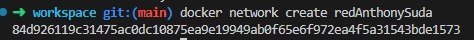
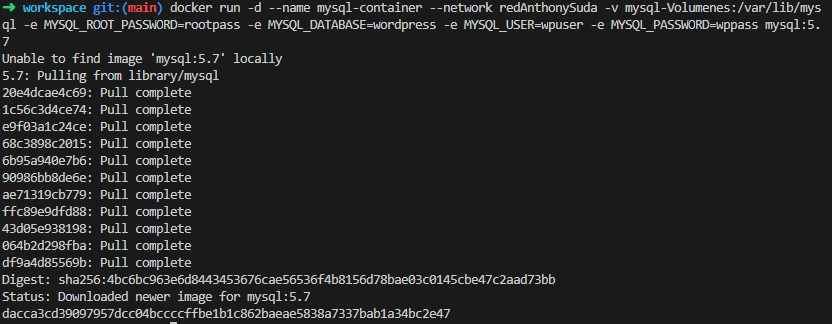
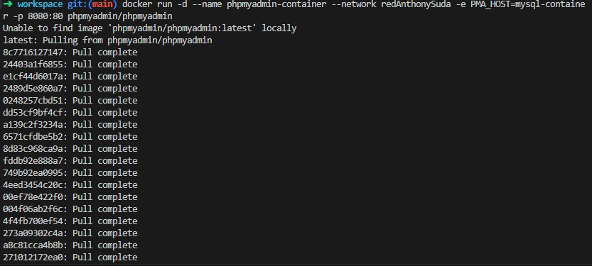
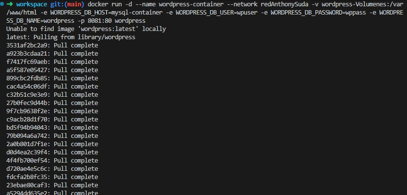
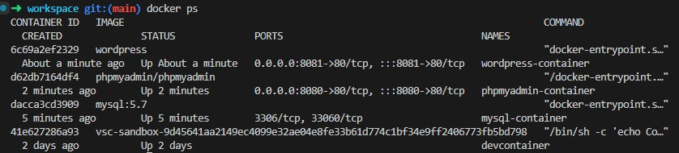

# Práctica Semana 5 — Contenedores Docker para WordPress
## Implementación de contenedores Docker con MySQL, phpMyAdmin y WordPress en red personalizada

---

## Duración
**120 minutos**

---

## Fundamentos

Docker es una herramienta que permite crear, ejecutar y gestionar **contenedores** — entornos aislados que contienen todo lo necesario para que una aplicación funcione correctamente (librerías, dependencias y configuraciones), evitando problemas de compatibilidad entre sistemas operativos.

En esta práctica se utilizaron los siguientes servicios:

- **MySQL** — Sistema de gestión de bases de datos relacional para almacenar y organizar la información de WordPress de forma estructurada.
- **phpMyAdmin** — Herramienta web con interfaz gráfica para administrar bases de datos sin depender exclusivamente de comandos.
- **WordPress** — Sistema de gestión de contenidos (CMS) que permite crear y administrar sitios web de forma sencilla.
- **Red personalizada Docker** — Permite la comunicación entre contenedores usando nombres en lugar de direcciones IP.
- **Volúmenes Docker** — Permiten persistir datos aunque los contenedores se reinicien o eliminen.

---

## Conocimientos previos requeridos

- Comandos básicos de Linux
- Uso de Docker
- Manejo de navegador web
- Conceptos básicos de redes
- Bases de datos relacionales

---

## Objetivos

- [x] Crear una red personalizada en Docker
- [x] Crear un volumen para WordPress
- [x] Crear un volumen para MySQL
- [x] Implementar un contenedor con MySQL
- [x] Implementar un contenedor con phpMyAdmin
- [x] Implementar un contenedor con WordPress
- [x] Establecer comunicación entre todos los contenedores
- [x] Verificar el funcionamiento con `docker ps`

---

## Equipo necesario

| Recurso | Detalle |
|--------|---------|
| Sistema operativo | Windows / Linux / macOS |
| Software | Docker instalado |
| Interfaz | Navegador web |
| Conectividad | Conexión a internet |
| Entorno utilizado | CodeSandbox (Devbox) |

---

## Material de apoyo

- [Documentación oficial de Docker](https://docs.docker.com/)
- [Docker Hub](https://hub.docker.com/)
- [Documentación oficial de WordPress](https://developer.wordpress.org/)
- Guía de la asignatura

---

## Procedimiento

### Paso 1 — Crear la red personalizada

Se creó una red Docker personalizada para aislar y conectar todos los contenedores entre sí usando nombres en lugar de IPs.

```bash
docker network create redAnthonySuda
```



---

### Paso 2 — Crear el volumen para WordPress

Se creó un volumen persistente donde se almacenarán los archivos de WordPress.

```bash
docker volume create wordpress-Volumenes
```


---

### Paso 3 — Crear el volumen para MySQL

Se creó un volumen persistente donde se almacenarán los datos de la base de datos MySQL.

```bash
docker volume create mysql-Volumenes
```


---

### Paso 4 — Crear el contenedor MySQL

Se desplegó el contenedor de MySQL versión 5.7 conectado a la red personalizada y al volumen creado.

```bash
docker run -d --name mysql-container --network redAnthonySuda -v mysql-Volumenes:/var/lib/mysql -e MYSQL_ROOT_PASSWORD=rootpass -e MYSQL_DATABASE=wordpress -e MYSQL_USER=wpuser -e MYSQL_PASSWORD=wppass mysql:5.7
```

**Variables de entorno utilizadas:**

| Variable | Valor |
|---|---|
| MYSQL_ROOT_PASSWORD | rootpass |
| MYSQL_DATABASE | wordpress |
| MYSQL_USER | wpuser |
| MYSQL_PASSWORD | wppass |



---

### Paso 5 — Crear el contenedor phpMyAdmin

Se desplegó phpMyAdmin conectado a la red y apuntando al contenedor MySQL mediante la variable `PMA_HOST`.

```bash
docker run -d --name phpmyadmin-container --network redAnthonySuda -e PMA_HOST=mysql-container -p 8080:80 phpmyadmin/phpmyadmin
```

- Puerto expuesto: **8080 → 80**
- Acceso: `http://localhost:8080`



---

### Paso 6 — Crear el contenedor WordPress

Se desplegó WordPress conectado a la red, al volumen y apuntando a MySQL con las credenciales configuradas.

```bash
docker run -d --name wordpress-container --network redAnthonySuda -v wordpress-Volumenes:/var/www/html -e WORDPRESS_DB_HOST=mysql-container -e WORDPRESS_DB_USER=wpuser -e WORDPRESS_DB_PASSWORD=wppass -e WORDPRESS_DB_NAME=wordpress -p 8081:80 wordpress
```

- Puerto expuesto: **8081 → 80**
- Acceso: `http://localhost:8081`



---

### Paso 7 — Verificación de contenedores activos

Se verificó que los tres contenedores estén corriendo correctamente.

```bash
docker ps
```

| CONTAINER ID | IMAGE | PORTS | NAMES |
|---|---|---|---|
| 6c69a2ef2329 | wordpress | 0.0.0.0:8081->80/tcp | wordpress-container |
| d62db7164df4 | phpmyadmin/phpmyadmin | 0.0.0.0:8080->80/tcp | phpmyadmin-container |
| dacca3cd3909 | mysql:5.7 | 3306/tcp, 33060/tcp | mysql-container |



---

## Diagrama de contenedores y puertos

```
┌──────────────────────────────────────────────────────────────┐
│                    Red: redAnthonySuda                       │
│                                                              │
│  ┌─────────────────┐  ┌──────────────────┐  ┌────────────┐  │
│  │   WordPress     │  │   phpMyAdmin     │  │  MySQL 5.7 │  │
│  │  :8081 → 80    │  │  :8080 → 80     │  │  :3306     │  │
│  └────────┬────────┘  └────────┬─────────┘  └─────┬──────┘  │
│           │                   │                   │         │
│           └──────────────────►│◄──────────────────┘         │
│                               ▼                             │
│                    mysql-container                          │
│                                                              │
│  Volúmenes:                                                  │
│  • wordpress-Volumenes → /var/www/html                       │
│  • mysql-Volumenes     → /var/lib/mysql                      │
└──────────────────────────────────────────────────────────────┘

Acceso desde el navegador:
  http://localhost:8081  →  WordPress
  http://localhost:8080  →  phpMyAdmin
```

---

## Resultados esperados

Se implementaron correctamente los contenedores de **MySQL**, **phpMyAdmin** y **WordPress** dentro de una red personalizada en Docker. Los tres servicios se comunicaron utilizando el nombre del contenedor como referencia (`WORDPRESS_DB_HOST=mysql-container` y `PMA_HOST=mysql-container`). Los datos persisten gracias a los volúmenes Docker creados para cada servicio.

---

## Bibliografía

- Docker Inc. (2024). *Docker Documentation: Networking overview*. Docker Docs. https://docs.docker.com/network/
- WordPress Foundation. (2024). *WordPress Developer Resources: Docker official image*. Docker Hub. https://hub.docker.com/_/wordpress
- Oracle Corporation. (2024). *MySQL 5.7 Reference Manual*. MySQL Documentation. https://dev.mysql.com/doc/refman/5.7/en/
